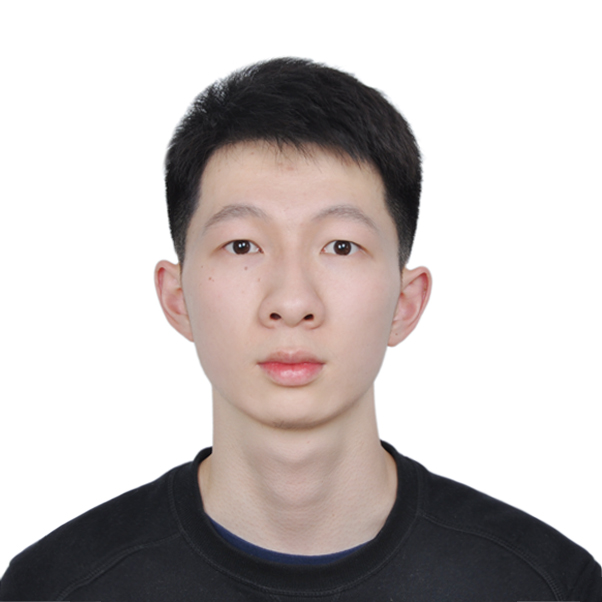

 

##Bio

I'm **Rui Qian**(**钱瑞**) and I'm now a final-year undergraduate student majoring in computer science at School of Electronic Engineering and Computer Science at Peking University, Beijing, P.R.China. I'm interested in Computer Vision and Deep Learning, specifically, on deep generative models, semantic scene parsing as well as object detection.  **I'm eager to apply for Ph.D this FALL. Contact me if you are interested.[[CV]]('./files/cv.pdf')**

 

## Publication

+ **Rui Qian**, Robby T. Tan, Wenhan Yang, Jiajun Su and Jiaying Liu. "Attentive Generative Adversarial Network for Raindrop Removal from A Single Image", Accepted by IEEE Conference on Computer Vision and Pattern Recognition (CVPR), June 2018 (**Spotlight**).

  [[Paper Link]](https://arxiv.org/abs/1711.10098) [[Project Page]](https://rui1996.github.io/raindrop/raindrop_removal.html) [[Code]](https://github.com/rui1996/DeRaindrop) [[Slides]](http://www.icst.pku.edu.cn/struct/Seminar/Talk_CVPR18_RuiQian/index.html) [[Video]](http://www.icst.pku.edu.cn/struct/Seminar/Talk_CVPR18_RuiQian/index.html)

  

+ **Rui Qian**, Yunchao Wei, Honghui Shi, Jiachen Li, Jiaying Liu, and Thomas Huang. "Weakly Supervised Scene Parsing with Point-based Distance Metric Learning", Accepted by AAAI Conference on Artificial Intelligence (AAAI), Honolulu, Hawaii, Jan. 2019.

  [[Paper Link]](https://arxiv.org/abs/1711.10098)(TBA)[[Code]]()(TBA)

##Research Experience

+ *2018.9 - Current*   **Reseacrh Intern**, [Visual Computing Group](https://www.microsoft.com/en-us/research/group/visual-computing/), [Microsoft Research Asia](https://www.microsoft.com/en-us/research/)   

   **Mentor: Dr. [Steve Lin](https://www.microsoft.com/en-us/research/people/stevelin/)** , **Dr. [Jifeng Dai](http://www.jifengdai.org/)**

  

+ *2018.6 - 2018.9*   **Research Intern**, [Image Formation and Processing Group](http://ifp-uiuc.github.io/), [University of Illinois Urbana-Champaign](http://illinois.edu/)

   **Advisor: Prof. [Thomas Huang](https://ece.illinois.edu/directory/profile/t-huang1)**

  

+ *2017.7 - 2017.9*     **Research Intern**, [Yale-NUS College](https://www.yale-nus.edu.sg/), [National University of Singapore](http://www.nus.edu.sg/) 

  **Advisor:  Prof. [Robby T.Tan](http://tanrobby.github.io/)**

  

+ *2017.2 - Current*   **Research Assistant**, [STRUCT,](http://www.icst.pku.edu.cn/struct/)  [Institute of Computer Science and Technology (ICST)](http://www.icst.pku.edu.cn/index.php?s=/Home/Index/index/lang/en.html), [Peking University](http://english.pku.edu.cn/)

  **Advisor: Prof. [Jiaying Liu](http://www.icst.pku.edu.cn/struct/people/liujiaying.html)**

  

## Contact

`qianrui@pku.edu.cn`

